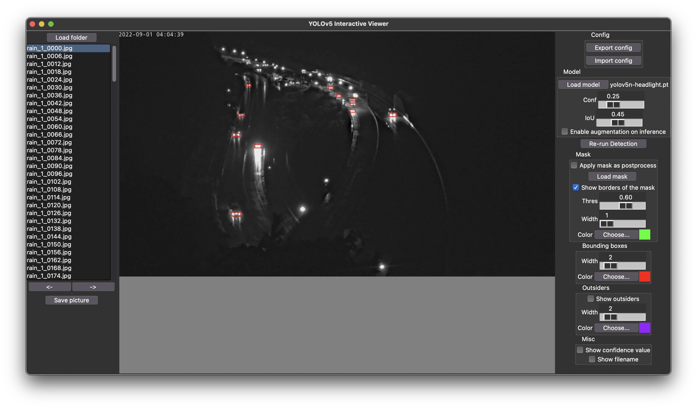

# YOLOv5 Interactive Viewer

## 使用用途
「1クラスのみを検出するモデル」を一つ使い、大量の画像に対して次々検出をして目視で確認したい

## 前提
- Python 3.10 (Torchが3.10を要求している)
- Poetry (依存関係管理に必要)

## 実行
まず、`poetry install`で依存関係をインストールする。  
その後、poetry環境内（`poetry run`, `poetry shell`経由）で以下のスクリプトを実行する。  

- `main.py`: ビュワー本体
- `video.py`: 動画に対して検出（ビュワーで出力できる設定ファイルが必要）

## モデル設定
以下の設定値は`consts.py`にある。

- `IMG_SIZE`: 入力画像の長辺サイズ（全ての入力画像はYOLOv5によってこのサイズにリサイズされる）
    - モデルの学習に使用した画像と同じサイズにすると精度がよくなることが期待される

## 制限
- 単一クラスのみを出力するモデルにのみ対応している
    - 複数クラスが出力された場合はどうなるかわからない
